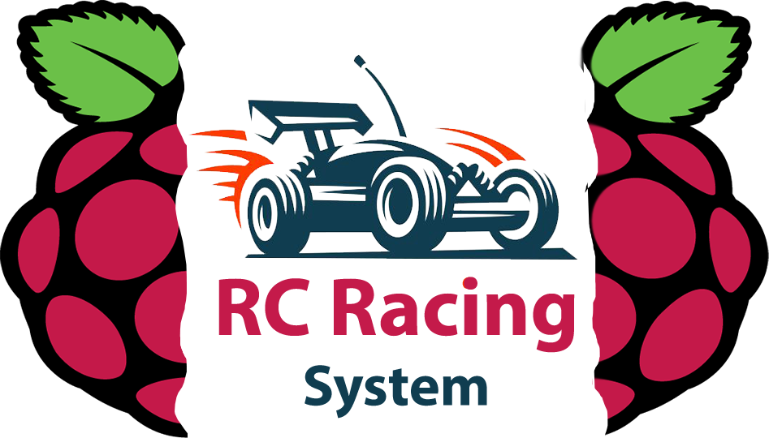

 

  

  <h3 align="center">RC Racing System</h3>

  

    An entertaining project for RC Racing.
  

## About The Project

With this project we are aiming at making RC racing more engaging and make it more of a social activity. To achieve this purpose we have created a web application from which it is possible to add friends and challenge them. There is also of course a touch of competitiveness, we keep scores of your challenges and there is a leaderboard visible to all users.

To race, you need to be pyhsically present at the racing track designed by us with our RC car. After interacting with the web application you can race on the track and we will keep track of your time.

## Built With

Backend:
* Java Spring Framework
* PostgreSQL

Frontend:
* HTML/CSS
* JavaScript
* JQuery

Track:
* RC Car
* Raspberry Pi 4
* IR Sensors
* Python

## Getting Started

To setup the system, read the prerequisites and set up your environment correctly, then go through the installation section step-by-step.

### Prerequisites

### Installation

To setup the system follow the instructions below.

## Testing

Below you can find detailed instructions on how to run tests.

#### Postman API testing:

1. Import the collection https://www.getpostman.com/collections/a91c1413ba01c724c95f
2. Log-in to the RC-Racing System
3. Find what cookie you are using at the moment, and copy it
4. Click on "Cookies" in the postman app(under the button "SEND")
5. Add the domain name "localhost"
6. Add a cookie with the following JSESSIONID=[your cookie]; Path=/; Domain=localhost; Secure; HttpOnly;
7. Click on "SAVE"
8. Test the different API requests by choosing a request and clicking on SEND
9. Test it by logging in to other users as well (cookie isn't changed if the same browser is used!)
10. You can add a request according to the appropriate package (Player/Race/etc.)
11. Type the request you wish to test, and click on "SEND". Then, check if the results are as you expect!

#### SELENIUM-IDE System Testing:

1. Download the SELENIUM-IDE for Chrome (https://chrome.google.com/webstore/detail/selenium-ide/mooikfkahbdckldjjndioackbalphokd?hl=en)
2. Log-in to the RC-Racing System
3. Open the SELENIUM-IDE
4. Open a project...
5. Choose the SIDE file called "RC-RacingSystem.side", attached in the project
6. Run the differerent tests. Pay attention to the fact that the tests are based on a testing user (liranneta23), and therefore some tests would probably fail if you run them from different users (for instance the "logging-in test")
7. In case you want to add tests by yourself:
	a. Add a test (click on the "+" button near "Tests")
	b. Click on "REC" (in the top right, below the 3 dots)
	c. Navigate to the screen/s you wish to test
	d. In case you want to test the value of a specific object, right-click on it, and then:
		Selenium-IDE --> Assert --> Text
	e. The actions which are checked during the recording, including the "Asserts", will be added to the   SELENIUM-IDE
	f. Choose a test you want to examine, and "Run current test"
	h. You can examine all the tests at once, by choosing "Run all tests"

#### Database Unit Testing:

All 3 database classes have been extensively unit tested. 
With the steps below you can execute all unit tests properly:

1. In your corresoing compiler, open the RC Racing System project
2. Go to src\main\java\M5Project.RC
3. Open every class in the "Resource" directory
4. Change the schema in the "DB_URL" string of every class to "rc_racing_system_db_dev".
This is done by edditing the text after "currentSchema=" in the string
5. Safe the changes
6. Right-click on directory "Test"
7. Click "Run 'Tests in 'M5Project.RC.Test''"
8. After testing, revert the changes in every class in directory "Resource".
This means to change the shcema to "rc_racing_system_db"
9. Safe the changes

## Usage
